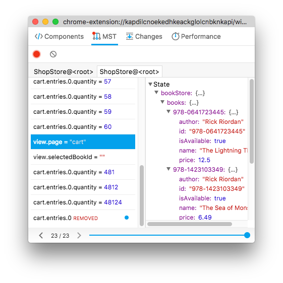

# mobx-devtools-advanced
This repository is home for:
* MobX Developer Tools (Advanced) for **Chrome** (not yet released)
* MobX Developer Tools (Advanced) for **Firefox** (not yet released)
* [Standalone app](#standalone-app) for Safari, IE etc. 

#### Early development

This fork is in early development, so some of this readme content may be incorrect. XD

At the moment, follow this page to install locally: [Hacking](Docs/Hacking.md)

#### Base features of mobx-devtools

* Inspect mobx-react observers. Edit values in observable objects. (Doesn't support editing react props/state, use react-devtools for that)
* Track changes in MobX observables
* MST support (see below).

#### New features in advanced version

TODO

#### mobx-state-tree
To allow inspecting MST root, do `npm install mobx-devtools-mst-advanced` and pass it to the function, exported as the default:
```js
import makeInspectable from 'mobx-devtools-mst-advanced';

const myStore = MyStore.create(/* ... */);

makeInspectable(myStore);
```



#### Standalone app

Install:
```sh
npm install --global mobx-devtools-advanced
```
Start: 
```sh
mobx-devtools-advanced
```


# Troubleshooting

### It doesn't work
Make sure that you are using [mobx](https://www.npmjs.com/package/mobx) 3.1.15 or higher and your app does not live inside an iframe. If that doesn't help, please [create an issue](https://github.com/Venryx/mobx-devtools-advanced/issues/new) with detail about your environment.

### Performance & Components tabs do not appear.
They appear only when you are using [mobx-react](https://www.npmjs.com/package/mobx-react) 4.2.2 or higher;


# Documentation

* [Hacking](Docs/Hacking.md): How to make local changes.
* [TreeTraversal](Docs/TreeTraversal.md): Documentation on how to traverse the tree of React components.